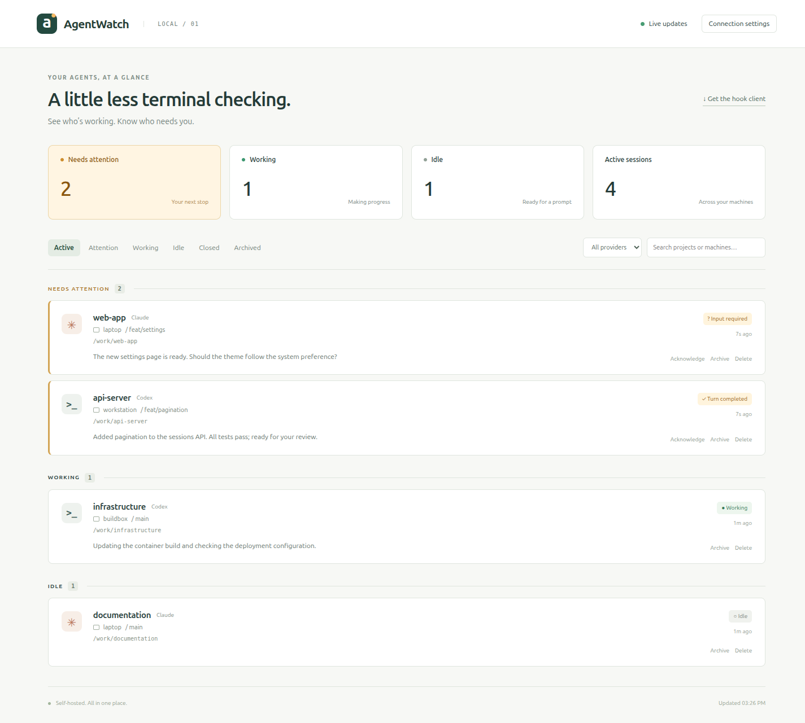
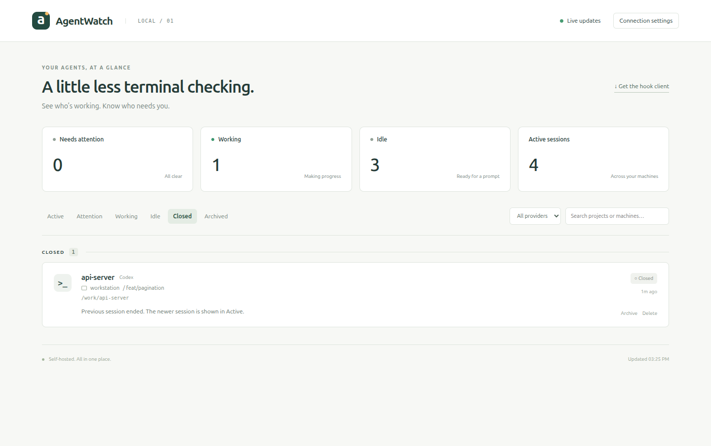

# AgentWatch

> [!WARNING]
> **100% VIBE CODED. NO MANUAL CODE WILL TOUCH THIS REPO.**
>
> Humans supply prompts, opinions, and bug reports. AI writes the code, tests,
> and documentation. Even the fixes come from another prompt.
>
> Yes, the AI wrote the tests too. This is a personal experiment;
> the vibes are not a warranty.

AgentWatch is a small, self-hosted dashboard for **Codex CLI** and **Claude Code**.
See which agents are working, which need your attention, and which are ready for
a new prompt—all in one browser tab. One Python server, one SQLite database,
and a portable hook client on each development machine.



*Screenshots show the real dashboard with sample sessions.*

## Run with Docker Compose

Copy this into `compose.yaml` on your server:

```yaml
services:
  agentwatch:
    image: ghcr.io/clemenselflein/agentwatch:latest
    build: https://github.com/ClemensElflein/AgentWatch.git
    restart: unless-stopped
    ports:
      - "8765:8765"
    environment:
      AGENTWATCH_DATABASE: /data/agentwatch.db
      AGENTWATCH_ARCHIVE_AFTER_HOURS: "24"
      AGENTWATCH_API_TOKEN: ""
    volumes:
      - agentwatch-data:/data
    init: true
    stop_grace_period: 5s

volumes:
  agentwatch-data:
```

Then run:

```bash
docker compose up -d --wait
```

Open **http://YOUR_SERVER:8765**. Compose pulls the published image, or builds
from this repository if the image is unavailable. The named volume preserves
sessions across container restarts. `docker compose down -v` deletes that data.

The empty API token is suitable for a trusted LAN. Set `AGENTWATCH_API_TOKEN` to
a secret value and use the same token in the client and browser Connection
settings when authentication is needed. Use HTTPS through a reverse proxy when
connecting over an untrusted network. Hook messages can include prompts,
responses, command descriptions, and working directories.

To update a published image:

```bash
docker compose pull
docker compose up -d --wait
```

## Connect your agents

On each development machine, replace `YOUR_SERVER` with your server's address:

```bash
curl -fLo agentwatch.pyz http://YOUR_SERVER:8765/agentwatch.pyz
python3 agentwatch.pyz install
```

The installer asks for the server URL, an optional token, and which detected
providers to connect. Keep launching `codex` and `claude` as usual.

- **Codex:** Open `/hooks` and review/trust the AgentWatch commands once. New or
  changed hooks are skipped until trusted. In Codex CLI 0.154.0, registration
  happens at the **first prompt**, not when an empty window opens.
- **Claude Code:** Start a fresh session after installation. Existing hooks are
  preserved; inspect `/hooks` if the session does not appear.

The client needs **Python 3.11+** on Linux, macOS, or WSL. Supported baselines are
**Codex CLI 0.154.0+** and **Claude Code 2.1.259+**. No pip dependencies, sudo,
CLI wrapper, or background discovery service are needed on development machines.

```bash
agentwatch status       # Check configuration and server connectivity
agentwatch test         # Send a sample attention card
agentwatch install      # Update the endpoint, token, or installed hooks
agentwatch uninstall    # Remove AgentWatch while preserving unrelated hooks
```

The installer places `agentwatch` in `~/.local/bin`. If that directory is not
on your PATH, use `~/.local/bin/agentwatch` for the commands above.

## What the dashboard shows

| State | Meaning |
| --- | --- |
| Needs attention | A turn finished, input is needed, or a failure/interruption was reported |
| Working | Processing a prompt or running tools |
| Idle | Ready for a prompt, or attention was acknowledged |
| Closed | The session ended; hidden from Active and available through Closed |

Permission requests have a **30-second server-side grace period**. Requests that
resolve during that window never flash an attention alert. Input questions and
turn completion appear immediately. The Needs attention summary turns yellow
only when at least one session needs attention.

On Linux, Codex Bash commands clear their permission alert when the client
observes the exact command starting, so long-running flash/playback jobs stay
Working. Update both the server and installed client to enable this behavior.
See [the observer's matching limits](docs/provider-hooks.md#state-inference-and-limits).

Filter by provider or state, search projects and machines, and acknowledge,
archive, restore, or delete dashboard records. Live updates reconnect
automatically. These controls do not approve commands or control the agents.

Closed sessions stay out of your way, including previous runs in the same
directory. Select **Closed** to view them:



## Builds and development

[The Docker workflow](.github/workflows/docker.yml) runs tests and builds Linux
AMD64 and ARM64 images on pull requests, pushes to `main`, and version tags.
Pushes to `main` publish `ghcr.io/clemenselflein/agentwatch:latest`; `v*` tags
publish versioned images. Pull requests build without publishing. The workflow
uses GitHub's built-in token for the container registry.

To build from a checkout:

```bash
git clone https://github.com/ClemensElflein/AgentWatch.git
cd AgentWatch
docker compose up -d --build --wait
```

To run the tests:

```bash
python3 -m venv .venv
.venv/bin/pip install -e '.[test]'
.venv/bin/pytest -q
```

Docker builds the downloadable client automatically. To build it separately,
run `python3 scripts/build-zipapp.py`. For local server development, run
`.venv/bin/python -m server`.

## Limits and reference

Hook events are snapshots, not a complete audit log. Offline events are dropped;
crashes can leave stale sessions. Long-running approved tools can still appear
to need permission after the grace period because the provider has no separate
approval-granted hook. AgentWatch does not read transcripts or run a background
process monitor. Inactivity archives sessions after 24 hours by default.

- [Configuration, persistence, client installation, API, and troubleshooting](docs/operations.md)
- [Provider hooks, state mapping, and coverage limits](docs/provider-hooks.md)
- [Verification notes](docs/verification.md)
